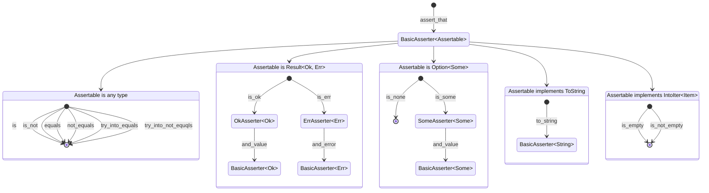

# Smoothy

Write smooth assertions in a fluent and readable way.

[](https://github.com/open-schnick/Smoothy/actions/workflows/check.yml)
[](https://github.com/open-schnick/Smoothy/actions/workflows/test.yml)
[](https://github.com/open-schnick/Smoothy/blob/master/LICENSE)
[](https://crates.io/crates/smoothy)

## Features

The crate is heavily inspired by [AssertJ](https://assertj.github.io/doc/)

- simple and readable syntax
- assertions based on the type of the asserted value
- assertion values use type conversion traits to make assertions readable

## Examples

All asserted are stared by calling `assert_that` on a value.  
After that various assertions based on the type of the asserted value can be made.

```rust
use smoothy::assert_that;

assert_that(42).equals(42);
```

```rust
use smoothy::assert_that;

assert_that(1u8).try_into_equals(1i8);
```

```rust
use smoothy::assert_that;

assert_that(String::from("Hello")).equals("Hello");
```

```rust
use smoothy::assert_that;

let result: Result<u8, String> = Ok(42);
assert_that(result)
    .is_ok()
    .and_value()
    .equals(42);
```

```rust
use smoothy::assert_that;

let result: Result<(), String> = Err(String::from("ups!"));
assert_that(result)
    .is_err()
    .and_error()
    .to_string()
    .equals("ups!");
```

```rust
use smoothy::assert_that;

let option: Option<()> = None;
assert_that(option).is_none();
```

```rust
use smoothy::assert_that;

let option: Option<u8> = Some(1);
assert_that(option)
    .is_some()
    .and_value()
    .equals(1);
```

```rust
use smoothy::assert_that;

let iterable: Vec<String> = vec![];
assert_that(iterable).is_empty();
```

```rust
use smoothy::assert_that;

assert_that(vec![1, 2, 3]).is_not_empty();
```

## Assertion Structure Diagram


