# Smoothy

Write smooth assertions in a fluent and readable way.

[](https://github.com/open-schnick/Smoothy/actions/workflows/check.yml)
[](https://github.com/open-schnick/Smoothy/actions/workflows/test.yml)
[](https://github.com/open-schnick/Smoothy/blob/master/LICENSE)
[](https://crates.io/crates/smoothy)

## Features

The crate is heavily inspired by [AssertJ](https://assertj.github.io/doc/)

- simple and readable syntax
- assertions based on the type of the asserted value
- assertion values use type conversion traits to make assertions readable

## Example

All asserted are stared by calling `assert_that` on a value.  
After that various assertions based on the type of the asserted value can be made.

```rust
use smoothy::prelude::*;

assert_that(42).equals(42);
assert_that(true).is_true();
assert_that(String::from("Hello")).equals("Hello");
```

More examples on [docs.rs](https://docs.rs/smoothy/latest/smoothy/)

## Assertion Structure Diagram

```mermaid
stateDiagram-v2
    [*] --> BasicAsserter&ltAssertable&gt : assert_that
    BasicAsserter&ltAssertable&gt --> Anything
    state "Assertable is any type" as Anything {
        [*] --> AssertionConnector&ltAssertable&gt : is
        [*] --> AssertionConnector&ltAssertable&gt : is_not
        [*] --> AssertionConnector&ltAssertable&gt : equals
        [*] --> AssertionConnector&ltAssertable&gt : not_equals
        [*] --> AssertionConnector&ltAssertable&gt : try_into_equals
        [*] --> AssertionConnector&ltAssertable&gt : try_into_not_equals
        [*] --> AssertionConnector&ltAssertable&gt : map
        AssertionConnector&ltAssertable&gt --> [*] : and
    }
    BasicAsserter&ltAssertable&gt --> Result
    state "Assertable is Result&ltOk, Err&gt" as Result {
        [*] --> OkAsserter&ltOk&gt : is_ok
        OkAsserter&ltOk&gt --> BasicAsserter&ltOk&gt : and_value
        [*] --> ErrAsserter&ltErr&gt : is_err
        ErrAsserter&ltErr&gt --> BasicAsserter&ltErr&gt : and_error
    }
    BasicAsserter&ltAssertable&gt --> Option
    state "Assertable is Option&ltSome&gt" as Option {
        [*] --> [*] : is_none
        [*] --> SomeAsserter&ltSome&gt : is_some
        SomeAsserter&ltSome&gt --> BasicAsserter&ltSome&gt : and_value
    }
    BasicAsserter&ltAssertable&gt --> ImplString
    state "Assertable implements ToString" as ImplString {
        [*] --> BasicAsserter&ltString&gt : to_string
    }
    BasicAsserter&ltAssertable&gt --> ImplToBool
    state "Assertable implements Into<bool>" as ImplToBool {
        [*] --> BasicAsserter&ltbool&gt : is_true
        [*] --> BasicAsserter&ltbool&gt : is_false
    }
    BasicAsserter&ltAssertable&gt --> ImplAsRefStr
    state "Assertable implements AsRef&ltstr&gt" as ImplAsRefStr {
        [*] --> AssertionConnector&ltAsRef&ltstr&gt&gt : contains
        [*] --> AssertionConnector&ltAsRef&ltstr&gt&gt : starts_with
        [*] --> AssertionConnector&ltAsRef&ltstr&gt&gt : matches
        AssertionConnector&ltAsRef&ltstr&gt&gt --> [*] : and
    }
    BasicAsserter&ltAssertable&gt --> ImplIntoIter
    state "Assertable implements IntoIter&ltItem&gt" as ImplIntoIter {
        [*] --> [*] : is_empty
        [*] --> [*] : is_not_empty
        [*] --> BasicAsserter&ltItem&gt: first
        [*] --> BasicAsserter&ltItem&gt: second
        [*] --> BasicAsserter&ltItem&gt: third
        [*] --> BasicAsserter&ltItem&gt: nth
    }
```


